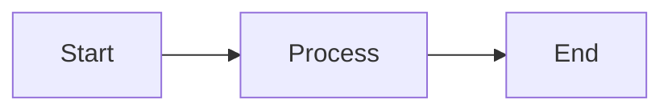

# Guide de démarrage rapide - Documentation

Ce guide vous permet de lancer la documentation MkDocs en quelques minutes.

## Installation rapide

### Option 1 : Script automatique (Linux/Mac)

```bash
# Rendre le script exécutable
chmod +x setup-docs.sh

# Lancer l'installation
./setup-docs.sh
```

Le script va :
- Vérifier Python et pip
- Créer un environnement virtuel
- Installer les dépendances
- Proposer de lancer le serveur

### Option 2 : Installation manuelle

```bash
# 1. Créer et activer un environnement virtuel (recommandé)
python3 -m venv venv
source venv/bin/activate  # Linux/Mac
# ou
venv\Scripts\activate  # Windows

# 2. Installer les dépendances
pip install -r requirements.txt

# 3. Lancer le serveur
mkdocs serve
```

## Accéder à la documentation

Ouvrez votre navigateur : **http://127.0.0.1:8000**

La documentation se recharge automatiquement quand vous modifiez les fichiers !

## Commandes utiles

### Développement

```bash
# Lancer le serveur avec auto-reload
mkdocs serve

# Lancer sur un port spécifique
mkdocs serve -a localhost:8080

# Mode verbose
mkdocs serve --verbose
```

### Build

```bash
# Générer les fichiers statiques
mkdocs build

# Vérifier les liens cassés
mkdocs build --strict

# Nettoyer avant build
mkdocs build --clean
```

### Déploiement

```bash
# Déployer sur GitHub Pages
mkdocs gh-deploy

# Avec message de commit personnalisé
mkdocs gh-deploy -m "Update documentation"

# Forcer le déploiement
mkdocs gh-deploy --force
```

## Structure de la documentation

```
docs/
├── index.md                    # Page d'accueil
├── getting-started/            # Guide de démarrage
│   ├── introduction.md
│   ├── prerequisites.md
│   ├── installation.md
│   └── configuration.md
├── architecture/               # Architecture
│   └── overview.md
├── cicd/                       # CI/CD
│   ├── overview.md
│   └── workflows.md
├── troubleshooting/            # Dépannage
│   └── faq.md
└── contributing.md             # Contribution
```

## Ajouter une page

1. **Créer un fichier markdown dans `docs/`**

```bash
# Exemple : nouvelle page de sécurité
touch docs/security/best-practices.md
```

2. **Ajouter du contenu**

```markdown
# Bonnes pratiques de sécurité

## Introduction

Voici les meilleures pratiques...

## Recommandations

- Point 1
- Point 2
```

3. **Ajouter dans la navigation (`mkdocs.yml`)**

```yaml
nav:
  - Sécurité:
      - Bonnes pratiques: security/best-practices.md
```

4. **Vérifier le résultat**

Le serveur (`mkdocs serve`) recharge automatiquement !

## Personnaliser

### Changer les couleurs

Éditer `mkdocs.yml` :

```yaml
theme:
  palette:
    primary: blue  # ou: red, green, purple, etc.
    accent: amber
```

### Ajouter un logo

```yaml
theme:
  logo: assets/logo.png
  favicon: assets/favicon.ico
```

### Activer des fonctionnalités

```yaml
theme:
  features:
    - navigation.tabs          # Onglets de navigation
    - navigation.expand        # Expansion auto de la nav
    - toc.integrate            # TOC intégrée
    - search.suggest           # Suggestions de recherche
    - content.code.copy        # Bouton copier le code
```

## Résolution de problèmes

### `mkdocs: command not found`

```bash
# Vérifier que l'environnement virtuel est activé
source venv/bin/activate

# Réinstaller mkdocs
pip install mkdocs-material
```

### Port 8000 déjà utilisé

```bash
# Utiliser un autre port
mkdocs serve -a localhost:8080
```

### Erreurs de build

```bash
# Build en mode strict (affiche toutes les erreurs)
mkdocs build --strict

# Mode verbose
mkdocs build --verbose
```

### Pages ne s'affichent pas

Vérifier que :
1. Le fichier est dans `docs/`
2. Le chemin dans `nav:` est correct
3. Le fichier a l'extension `.md`
4. La syntaxe YAML est correcte

## Syntaxe Markdown

### Titres

```markdown
# Titre H1
## Titre H2
### Titre H3
```

### Listes

```markdown
- Item 1
- Item 2
  - Sub-item

1. Premier
2. Deuxième
```

### Code

````markdown
```python
def hello():
    print("Hello, World!")
```
````

### Liens

```markdown
[Texte du lien](url)
[Page interne](../autre-page.md)
```

### Images

```markdown

```

### Admonitions

```markdown
!!! note "Titre"
    Contenu de la note

!!! warning "Attention"
    Message d'avertissement

!!! tip "Astuce"
    Conseil pratique
```

### Diagrammes Mermaid

````markdown

````

## Déploiement automatique

Le projet inclut un workflow GitHub Actions (`.github/workflows/deploy-docs.yml`) qui :

1. Se déclenche sur push vers `main`
2. Build la documentation
3. Déploie sur GitHub Pages

La documentation sera accessible sur :
```
https://VOTRE-USERNAME.github.io/VOTRE-REPO/
```

### Activer GitHub Pages

1. Aller dans **Settings** → **Pages**
2. Source : **Deploy from a branch**
3. Branch : **gh-pages** / **(root)**
4. Sauvegarder

## Ressources

- [MkDocs Documentation](https://www.mkdocs.org/)
- [Material for MkDocs](https://squidfunk.github.io/mkdocs-material/)
- [Markdown Guide](https://www.markdownguide.org/)
- [Mermaid Diagrams](https://mermaid.js.org/)

## Checklist avant publication

- [ ] Toutes les pages sont accessibles
- [ ] Pas de liens cassés (`mkdocs build --strict`)
- [ ] Images affichées correctement
- [ ] Code syntaxiquement correct
- [ ] Navigation claire et logique
- [ ] Orthographe vérifiée
- [ ] Screenshots à jour

## Prochaines étapes

Une fois la doc lancée, consultez :

1. [README.md](README.md) - Vue d'ensemble du projet de documentation
2. [index.md](docs/index.md) - Page d'accueil de la documentation
3. [contributing.md](docs/contributing.md) - Guide de contribution

---

