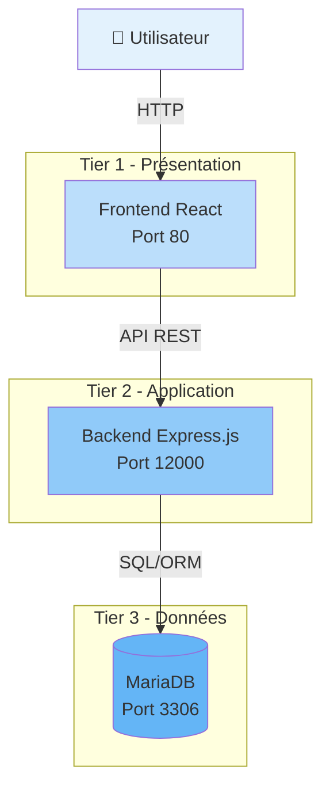
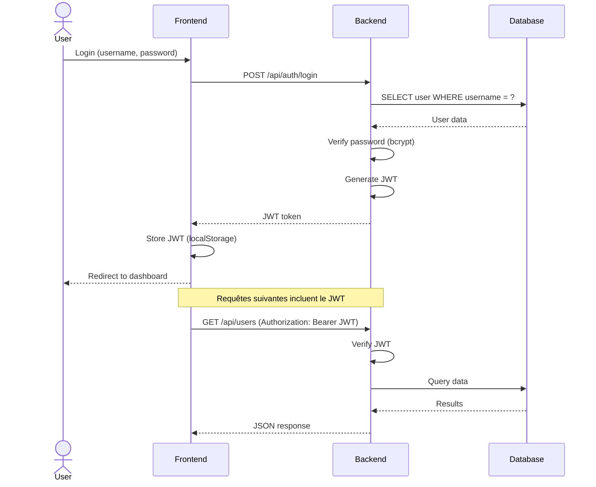
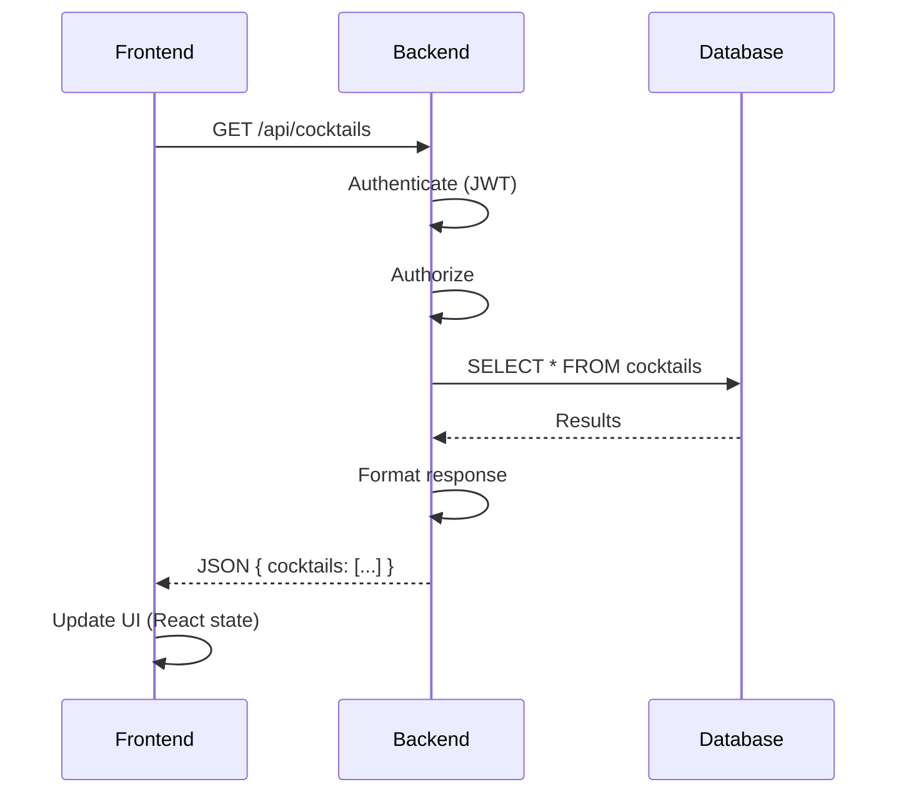
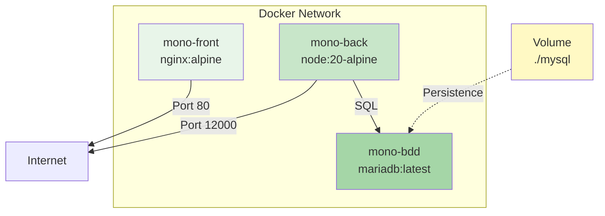
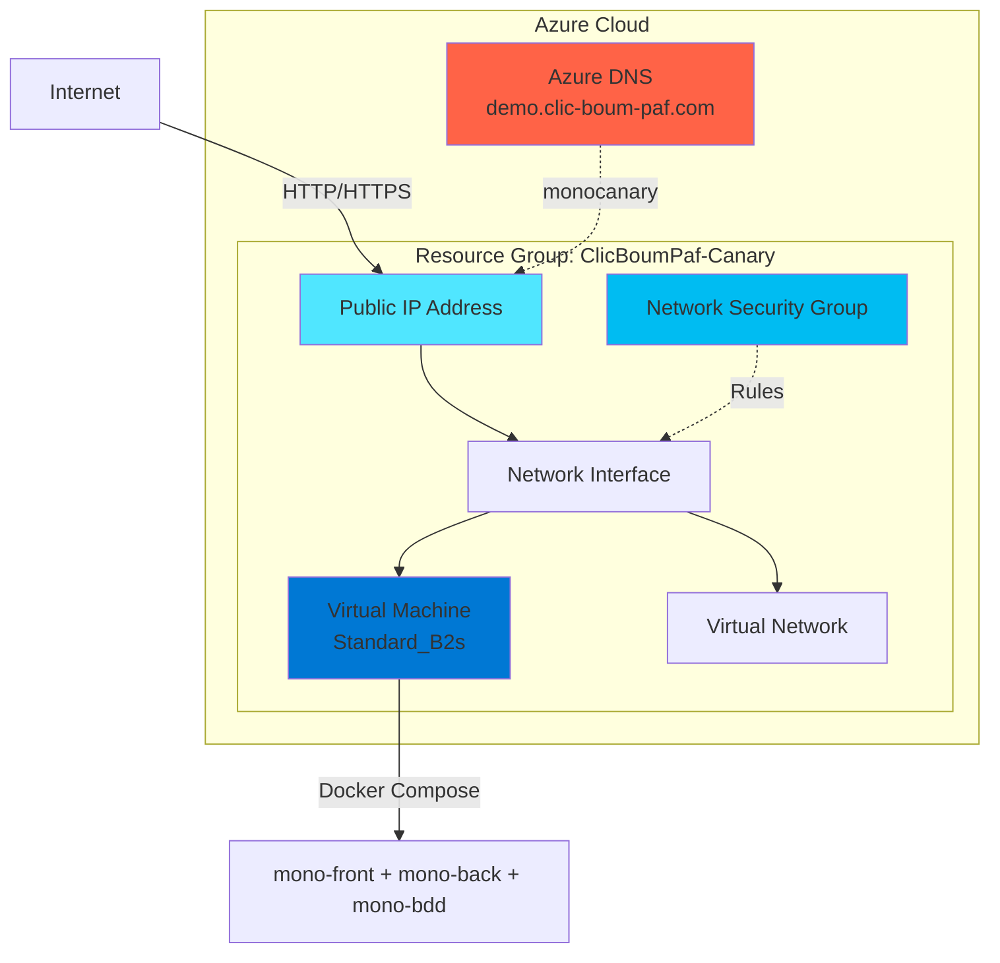
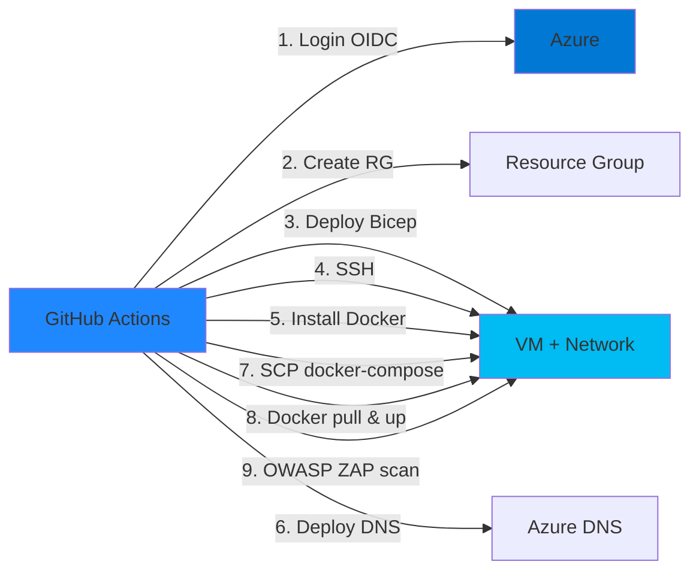
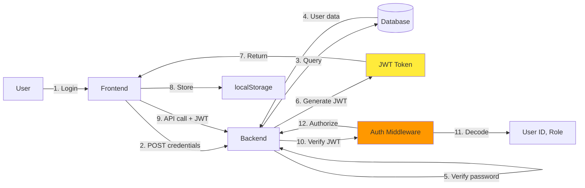
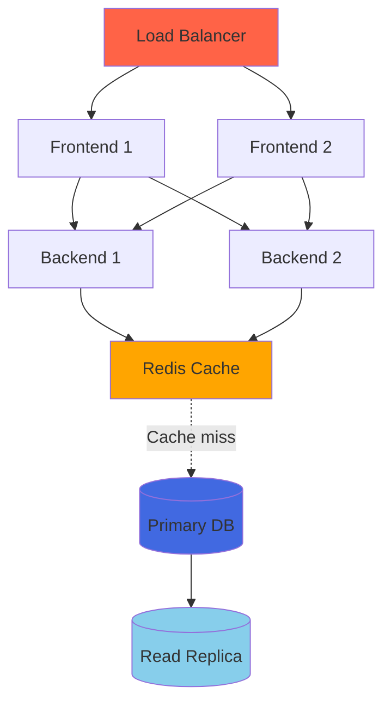
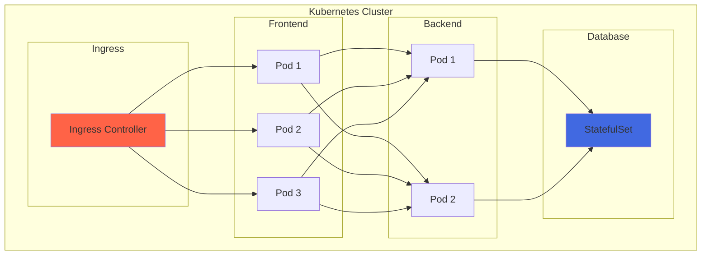
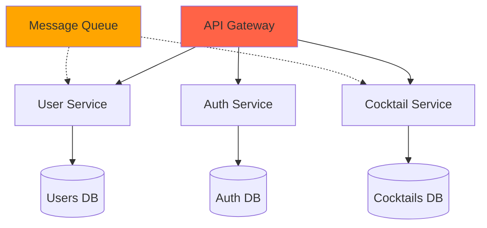

# Architecture - Vue d'ensemble

Cette page présente l'architecture globale du projet Cocktail ClicBoumPaf.

## Architecture 3-tiers

Le projet suit une architecture **3-tiers classique** séparant présentation, logique applicative et données.



## Composants principaux

### Frontend - React Application

**Technologies :**

- React 19.0.0 (UI library)
- React Router 7.1.5 (Routing)
- Vite 6.1.0 (Build tool)
- Axios (HTTP client)

**Responsabilités :**

- Interface utilisateur
- Gestion de l'état (React hooks)
- Routing côté client
- Communication API avec le backend
- Authentification (JWT storage)

**Structure :**

```
frontend/src/
├── components/     # Composants réutilisables
├── pages/          # Pages de l'application
├── hooks/          # Custom React hooks
├── utils/          # Fonctions utilitaires
├── api/            # Clients API
└── App.jsx         # Composant racine
```

### Backend - Express.js API

**Technologies :**

- Express.js 4.19.2 (Framework web)
- Sequelize 6.37.3 (ORM)
- JWT (Authentification)
- Bcrypt (Hash passwords)

**Responsabilités :**

- API REST
- Logique métier
- Authentification & autorisation
- Validation des données
- Communication avec la BDD

**Structure :**

```
backend/api/
├── controllers/    # Logique des endpoints
├── models/         # Modèles Sequelize
├── routes/         # Définition des routes
├── middlewares/    # Middlewares (auth, etc.)
└── config/         # Configuration (BDD, etc.)
```

### Base de données - MariaDB

**Technologies :**

- MariaDB latest
- Sequelize ORM

**Responsabilités :**

- Stockage persistant
- Relations entre entités
- Contraintes d'intégrité

**Schéma (exemple) :**

```sql
CREATE TABLE users (
    id INT PRIMARY KEY AUTO_INCREMENT,
    username VARCHAR(255) UNIQUE NOT NULL,
    email VARCHAR(255) UNIQUE NOT NULL,
    password VARCHAR(255) NOT NULL,
    created_at TIMESTAMP DEFAULT CURRENT_TIMESTAMP
);

CREATE TABLE cocktails (
    id INT PRIMARY KEY AUTO_INCREMENT,
    name VARCHAR(255) NOT NULL,
    description TEXT,
    user_id INT,
    FOREIGN KEY (user_id) REFERENCES users(id)
);
```

## Flux de communication

### Flux d'authentification



### Flux API classique



## Architecture Docker

### Containers



### Docker Compose

```yaml
services:
  mono-bdd:
    image: mariadb:latest
    volumes:
      - ./mysql:/var/lib/mysql  # Persistence
    environment:
      MARIADB_ROOT_PASSWORD: TOOR
      MARIADB_DATABASE: bddname
      MARIADB_USER: roger
      MARIADB_PASSWORD: regor
    healthcheck:
      test: ['CMD', '/usr/local/bin/healthcheck.sh']
    
  mono-back:
    image: ${MONO_PROJECT_BACK}
    ports:
      - 12000:12000
    environment:
      BDD_HOST: mono-bdd
      BDD_PORT: 3306
    depends_on:
      mono-bdd:
        condition: service_healthy  # Attend que la BDD soit prête
    
  mono-front:
    image: ${MONO_PROJECT_FRONT}
    ports:
      - 80:80
```

## Architecture Azure (Canary)

### Infrastructure déployée



### Network Security Group Rules

| Rule | Port | Protocol | Source | Destination |
|------|------|----------|--------|-------------|
| SSH | 22 | TCP | * | * |
| HTTP | 80 | TCP | * | * |
| Backend | 12000 | TCP | * | * |

### Flux de déploiement



## Sécurité

### Authentification & Autorisation



### Layers de sécurité

1. **Network Layer** : NSG Azure, HTTPS (à implémenter)
2. **Application Layer** : JWT, input validation, CORS
3. **Data Layer** : Hashed passwords (bcrypt), prepared statements (Sequelize)

## Performance & Scalabilité

### Limites actuelles (Phase 1)

- Pas de load balancing
- Pas de cache (Redis)
- Pas de CDN
- Scalabilité verticale uniquement

### Optimisations possibles



## Évolution future

### Phase 2 : Kubernetes

Migration vers une architecture cloud-native :



### Phase 3 : Microservices

Découpage en services métier :



---

## Approfondissement

Pour en savoir plus sur chaque composant :

- [Backend](backend.md) - Architecture détaillée du backend
- [Frontend](frontend.md) - Architecture du frontend React
- [Base de données](database.md) - Schéma et modèles
- [Docker](docker.md) - Configuration Docker complète

---

!!! info "Architecture évolutive"
    Cette architecture simple (Phase 1) est volontairement basique pour faciliter l'apprentissage. Les phases suivantes introduiront progressivement la complexité (K8s, microservices).
