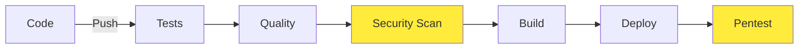
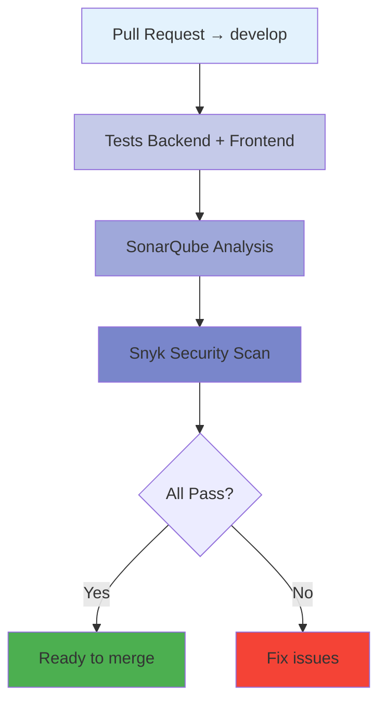
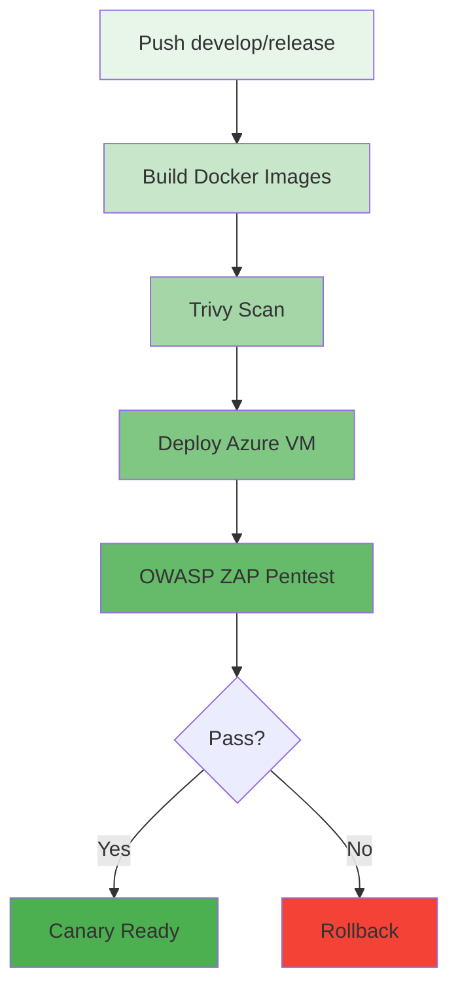
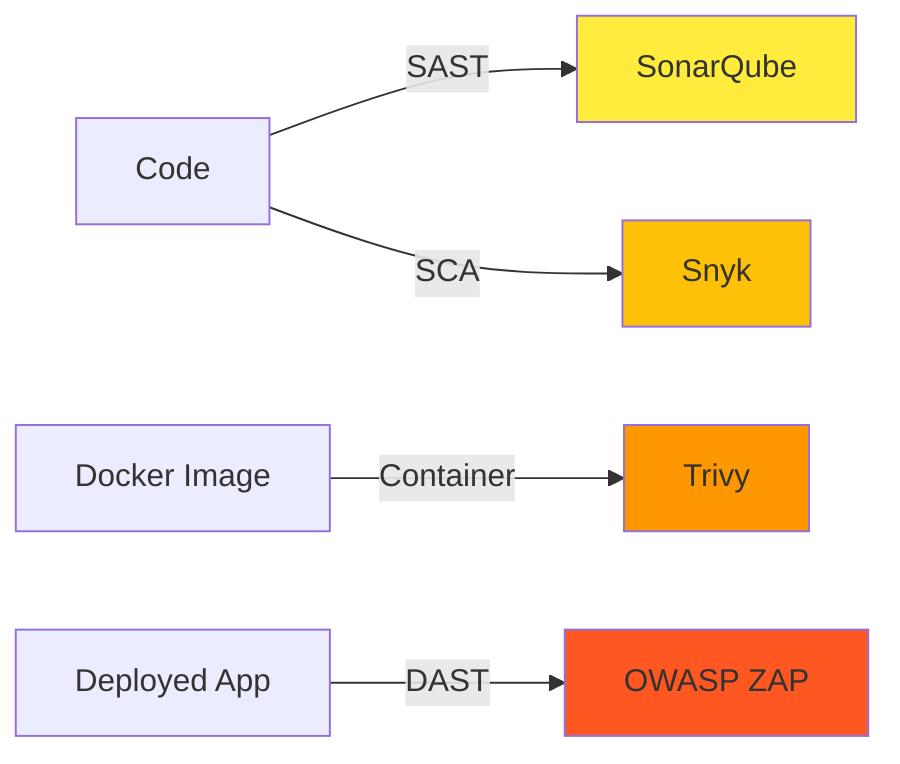
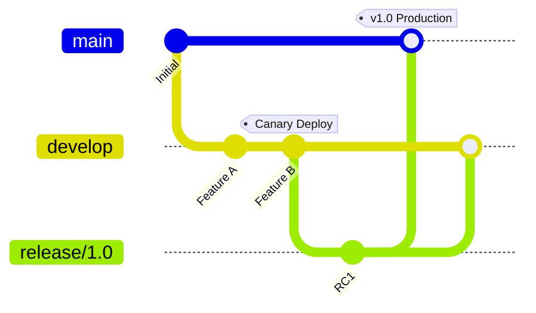

# Vue d'ensemble CI/CD

Le projet Cocktail ClicBoumPaf implémente une stratégie DevSecOps complète avec **deux pipelines principaux** orchestrés par GitHub Actions.

## Philosophie DevSecOps

Le projet suit les principes **Shift-Left Security** : intégrer la sécurité dès les premières étapes du développement.



**Avantages :**

- Détection précoce des vulnérabilités
- Réduction des coûts de correction
- Amélioration de la qualité du code
- Déploiements plus sûrs

## Les deux pipelines

### Pipeline 01 - Integration (Pull Request)

**Déclencheur :** Pull Request vers `develop`  
**Objectif :** Valider le code avant le merge



**Étapes :**

1. **Tests unitaires Backend** (Jest)
2. **Tests E2E Frontend** (Cypress)
3. **Analyse qualité** (SonarQube)
4. **Scan sécurité** (Snyk)

**Résultat :** Merge bloqué si au moins un job échoue.

### Pipeline 02 - Canary (Push develop)

**Déclencheur :** Push sur `develop` ou `release/*`  
**Objectif :** Déployer en environnement Canary pour validation



**Étapes :**

1. **Build & Push** images Docker vers GHCR
2. **Scan Trivy** des images
3. **Déploiement Azure** (VM avec ARM/Bicep)
4. **Pentest OWASP ZAP**

**Résultat :** Environnement Canary accessible pour validation manuelle.

## Vue d'ensemble des workflows

| Workflow | Fichier | Déclencheur | Durée |
|----------|---------|-------------|-------|
| **01 - Integration** | `_01_Integration.yaml` | PR → develop | ~5 min |
| **01-1 - Tests** | `01-1_TestBackFront.yaml` | Appelé par 01 | ~2 min |
| **01-2 - SonarQube** | `01-2_SonarQube.yaml` | Appelé par 01 | ~1 min |
| **01-3 - Snyk** | `01-3_Snyk.yaml` | Appelé par 01 | ~2 min |
| **02 - Canary** | `_02_Canary.yaml` | Push develop | ~15 min |
| **02-2 - Trivy** | `02-2_TrivyScan.yaml` | Appelé par 02 | ~3 min |
| **02-3 - Deploy** | `02-3_DeployCanary.yaml` | Appelé par 02 | ~8 min |
| **02-4 - ZAP** | `02-4_ZapScan.yaml` | Appelé par 02 | ~4 min |

## Sécurité intégrée

Le pipeline intègre **4 niveaux de sécurité** :

### 1. Analyse statique (SAST)

**Outil :** SonarQube  
**Phase :** Integration  
**Cible :** Code source (backend + frontend)

- Vulnérabilités du code
- Code smells
- Bugs potentiels
- Couverture de tests

### 2. Analyse des dépendances (SCA)

**Outil :** Snyk  
**Phase :** Integration  
**Cible :** `package.json`, `package-lock.json`

- CVE dans les dépendances
- Licences incompatibles
- Mises à jour de sécurité disponibles

### 3. Scan des images (Container Security)

**Outil :** Trivy  
**Phase :** Canary  
**Cible :** Images Docker buildées

- Vulnérabilités OS
- Vulnérabilités dans les packages
- Configuration Docker

### 4. Test de pénétration (DAST)

**Outil :** OWASP ZAP  
**Phase :** Canary (post-déploiement)  
**Cible :** Application déployée

- Injection SQL
- XSS
- CSRF
- Headers de sécurité
- OWASP Top 10



## Stratégies de déploiement

### Canary Release

Le projet utilise une **stratégie Canary** :

1. Déploiement sur un environnement isolé (VM Azure)
2. Tests automatisés (OWASP ZAP)
3. Validation manuelle possible
4. Promotion vers production si OK

**Avantages :**

- Détection précoce des problèmes
- Rollback facile
- Tests en conditions réelles
- Risque limité

### GitFlow mapping



| Branche | Environnement | Pipeline |
|---------|---------------|----------|
| `feature/*` | - | - |
| `develop` | Canary | Pipeline 02 |
| `release/*` | Staging | Pipeline 02 |
| `main` | Production | (Phase 2) |

## Métriques & Qualité

### Gates de qualité

Le projet définit des **quality gates** stricts :

**SonarQube :**

- Coverage > 80%
- 0 Bugs critiques
- 0 Vulnérabilités
- Technical Debt < 5%

**Snyk :**

- 0 vulnérabilités critiques
- 0 vulnérabilités hautes non corrigées > 30 jours

**Trivy :**

- 0 vulnérabilités critiques dans l'image
- 0 vulnérabilités hautes non patchées

### Monitoring des pipelines

GitHub Actions fournit :

- Historique des exécutions
- Temps d'exécution
- Taux de succès/échec
- Logs détaillés
- Artifacts (rapports, coverage)

## Secrets & Variables

### Secrets GitHub requis

| Secret | Description | Utilisé par |
|--------|-------------|-------------|
| `AZURE_CLIENT_ID` | App Registration ID | Deploy Canary |
| `AZURE_TENANT_ID` | Tenant Azure ID | Deploy Canary |
| `AZURE_SUBSCRIPTION_ID` | Subscription ID | Deploy Canary |
| `AZURE_VM_LOGIN` | Login admin VM | Deploy Canary |
| `AZURE_VM_PASSWORD` | Password admin VM | Deploy Canary |
| `MONOREPO_PAT` | GitHub PAT (GHCR) | Docker build |
| `SONAR_TOKEN` | Token SonarCloud | SonarQube |
| `SNYK_TOKEN` | Token Snyk | Snyk scan |

### Variables d'environnement

Définies dans les workflows :

```yaml
env:
  ResourceGroupName: "ClicBoumPaf-Canary"
  ResourceGroupLocation: "francecentral"
  PORT: "22"
```

## Lancer un workflow manuellement

Depuis l'interface GitHub :

1. Aller dans **Actions**
2. Sélectionner le workflow
3. Cliquer sur **Run workflow**
4. Choisir la branche
5. Lancer

## Prochaines étapes

Pour approfondir :

- [Workflows détaillés](workflows.md)
- [Pipeline Integration](integration.md)
- [Pipeline Canary](canary.md)
- [Tests & Qualité](testing.md)
- [Sécurité](security.md)

---

!!! tip "Best Practices"
    - Toujours passer par une PR pour merger sur `develop`
    - Vérifier les quality gates avant de merger
    - Valider l'environnement Canary avant promotion
    - Monitorer les métriques de sécurité régulièrement
