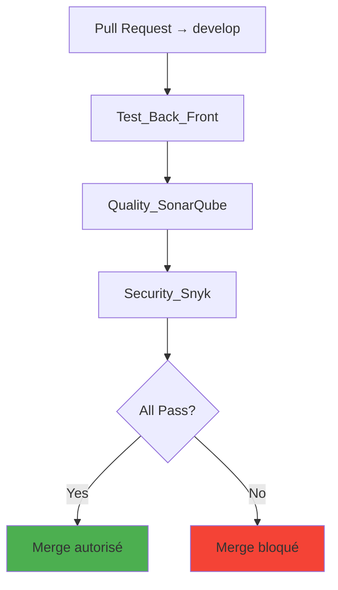
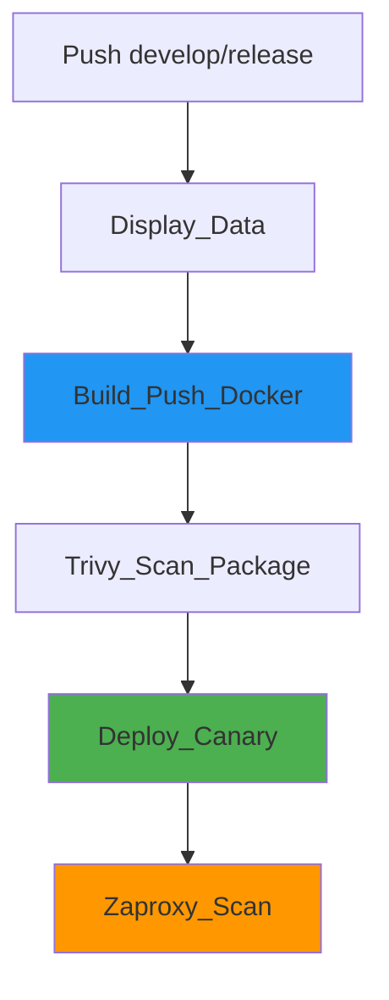

# Workflows détaillés

Guide complet de tous les workflows GitHub Actions du projet.

## Organisation des workflows

```
.github/workflows/
├── _01_Integration.yaml       # Pipeline principal Integration
├── _02_Canary.yaml            # Pipeline principal Canary
├── 01-1_TestBackFront.yaml    # Tests unitaires + E2E
├── 01-2_SonarQube.yaml        # Analyse qualité
├── 01-3_Snyk.yaml             # Scan sécurité dépendances
├── 02-2_TrivyScan.yaml        # Scan images Docker
├── 02-3_DeployCanary.yaml     # Déploiement Azure
├── 02-4_ZapScan.yaml          # Pentest OWASP ZAP
└── z_Docker-Ghcr.yaml         # Build & Push Docker
```

## Workflow 01 - Integration

### Déclencheur

```yaml
on:
  pull_request:
    branches:
      - develop
```

### Jobs orchestrés



### Détail du workflow

```yaml
name: 01 - Integration

on:
  pull_request:
    branches:
      - develop

jobs:
  Test_Back_Front:
    uses: ./.github/workflows/01-1_TestBackFront.yaml

  Quality_SonarQube:
    needs: [Test_Back_Front]
    uses: ./.github/workflows/01-2_SonarQube.yaml
    secrets: inherit

  Security_Snyk:
    needs: [Quality_SonarQube]
    uses: ./.github/workflows/01-3_Snyk.yaml
    secrets: inherit
```

**Caractéristiques :**

- Exécution séquentielle avec `needs`
- Partage des secrets avec `secrets: inherit`
- Bloque le merge si un job échoue
- Durée : ~5-7 minutes

## Workflow 02 - Canary

### Déclencheur

```yaml
on:
  push:
    branches:
      - develop
      - release/*
```

### Jobs orchestrés



### Détail du workflow

```yaml
name: 02 - Canary

on:
  push:
    branches:
      - develop
      - release/*

jobs:
  Display_Data:
    runs-on: ubuntu-latest
    steps:
      - run: env | sort

  Build_Push_Docker:
    if: ${{github.ref_name == 'develop'}}
    uses: ./.github/workflows/z_Docker-Ghcr.yaml
    secrets: inherit
    with:
      docker-mode: canary

  Trivy_Scan_Package:
    needs: [Build_Push_Docker]
    uses: ./.github/workflows/02-2_TrivyScan.yaml
    secrets: inherit

  Deploy_Canary:
    uses: ./.github/workflows/02-3_DeployCanary.yaml
    secrets: inherit
    permissions:
      id-token: write

  Zaproxy_Scan:
    needs: [Deploy_Canary]
    uses: ./.github/workflows/02-4_ZapScan.yaml
    permissions:
      issues: write
```

**Caractéristiques :**

- Jobs conditionnels avec `if`
- Permissions spécifiques par job
- Durée : ~15-20 minutes

## Workflow 01-1 : Tests Backend & Frontend

### Backend Tests (Jest)

```yaml
- name: Run Backend Tests
  working-directory: ./backend
  run: |
    npm ci
    npm run test:cov

- name: Upload Coverage
  uses: codecov/codecov-action@v3
  with:
    file: ./backend/coverage/lcov.info
    flags: backend
```

**Tests inclus :**

- Tests unitaires des controllers
- Tests des routes API
- Tests des modèles Sequelize
- Tests des middlewares

### Frontend Tests (Cypress)

```yaml
- name: Run Frontend E2E Tests
  working-directory: ./frontend
  run: |
    npm ci
    npm run cypress:run

- name: Upload Coverage
  uses: codecov/codecov-action@v3
  with:
    file: ./frontend/coverage/lcov.info
    flags: frontend
```

**Tests inclus :**

- Tests E2E de navigation
- Tests de formulaires
- Tests d'authentification
- Tests des composants critiques

## Workflow 01-2 : SonarQube

### Analyse Backend

```yaml
- name: SonarQube Scan Backend
  uses: sonarsource/sonarqube-scan-action@master
  env:
    SONAR_TOKEN: ${{ secrets.SONAR_TOKEN }}
    SONAR_HOST_URL: https://sonarcloud.io
  with:
    projectBaseDir: backend
    args: >
      -Dsonar.projectKey=cocktail-backend
      -Dsonar.sources=.
      -Dsonar.exclusions=node_modules/**,test/**,coverage/**
      -Dsonar.javascript.lcov.reportPaths=coverage/lcov.info
```

### Analyse Frontend

```yaml
- name: SonarQube Scan Frontend
  uses: sonarsource/sonarqube-scan-action@master
  env:
    SONAR_TOKEN: ${{ secrets.SONAR_TOKEN }}
    SONAR_HOST_URL: https://sonarcloud.io
  with:
    projectBaseDir: frontend
    args: >
      -Dsonar.projectKey=cocktail-frontend
      -Dsonar.sources=src
      -Dsonar.exclusions=node_modules/**,cypress/**,dist/**
```

**Métriques analysées :**

- Code coverage
- Code smells
- Bugs potentiels
- Vulnérabilités
- Duplication de code
- Complexité cyclomatique

## Workflow 01-3 : Snyk

```yaml
- name: Run Snyk to check for vulnerabilities
  uses: snyk/actions/node@master
  env:
    SNYK_TOKEN: ${{ secrets.SNYK_TOKEN }}
  with:
    args: --severity-threshold=high
    command: test
```

**Vérifications :**

- Vulnérabilités dans `package.json`
- CVE dans les dépendances transitives
- Licences incompatibles
- Patches disponibles

## Workflow z_Docker-Ghcr : Build & Push

### Build multi-plateforme

```yaml
- name: Build and push Backend
  uses: docker/build-push-action@v5
  with:
    context: ./backend
    file: ./backend/Dockerfile
    push: true
    tags: |
      ghcr.io/${{ github.repository_owner }}/cocktail_base_3t-back:canary
      ghcr.io/${{ github.repository_owner }}/cocktail_base_3t-back:${{ github.sha }}
    cache-from: type=gha
    cache-to: type=gha,mode=max
```

**Optimisations :**

- Build cache GitHub Actions
- Multi-stage Dockerfile
- Image optimisée (Alpine)
- Tags multiples (canary + SHA)

## Workflow 02-2 : Trivy Scan

```yaml
- name: Run Trivy vulnerability scanner
  uses: aquasecurity/trivy-action@master
  with:
    image-ref: ghcr.io/${{ github.repository }}-back:canary
    format: 'sarif'
    output: 'trivy-results.sarif'
    severity: 'CRITICAL,HIGH'

- name: Upload Trivy results to GitHub Security
  uses: github/codeql-action/upload-sarif@v2
  with:
    sarif_file: 'trivy-results.sarif'
```

**Scans effectués :**

- Vulnérabilités OS
- Vulnérabilités packages
- Misconfiguration
- Secrets exposés

## Workflow 02-3 : Deploy Canary

### Étapes de déploiement

1. **Login Azure avec OIDC**

```yaml
- name: Azure Login
  uses: azure/login@v2
  with:
    client-id: ${{ secrets.AZURE_CLIENT_ID }}
    tenant-id: ${{ secrets.AZURE_TENANT_ID }}
    subscription-id: ${{ secrets.AZURE_SUBSCRIPTION_ID }}
```

2. **Création du Resource Group**

```yaml
- name: Azure CLI Create Resource Group
  uses: azure/CLI@v2
  with:
    inlineScript: |
      az group create \
        --name ${{env.ResourceGroupName}} \
        --location ${{env.ResourceGroupLocation}}
```

3. **Déploiement ARM/Bicep**

```yaml
- name: Azure ARM Deploy
  uses: azure/arm-deploy@v2
  with:
    resourceGroupName: ${{env.ResourceGroupName}}
    scope: resourcegroup
    template: ./infra/main.bicep
    parameters: >
      adminUsername=${{secrets.AZURE_VM_LOGIN}}
      adminPasswordOrKey=${{secrets.AZURE_VM_PASSWORD}}
      vmName="Canary-Server"
      vmSize="Standard_B2s"
```

4. **Configuration réseau (NSG)**

```yaml
- name: Open Port on Security Group
  uses: azure/CLI@v2
  with:
    inlineScript: |
      az network nsg rule create \
        --resource-group ${{env.ResourceGroupName}} \
        --nsg-name SecGroupNet \
        --name PortBack-12000 \
        --priority 100 \
        --direction Inbound \
        --access Allow \
        --protocol Tcp \
        --destination-port-ranges 12000
```

5. **Installation Docker sur VM**

```yaml
- name: Install Docker on VM
  uses: appleboy/ssh-action@v1.0.3
  with:
    host: ${{env.AZURE_VM_IP}}
    username: ${{secrets.AZURE_VM_LOGIN}}
    password: ${{secrets.AZURE_VM_PASSWORD}}
    script: |
      curl -fsSL https://get.docker.com -o get-docker.sh
      sudo sh get-docker.sh
```

6. **Déploiement de l'application**

```yaml
- name: Start compose file
  uses: appleboy/ssh-action@v1.0.3
  with:
    host: ${{env.AZURE_VM_IP}}
    username: ${{secrets.AZURE_VM_LOGIN}}
    password: ${{secrets.AZURE_VM_PASSWORD}}
    script: |
      echo ${{secrets.MONOREPO_PAT}} | docker login ghcr.io -u USERNAME --password-stdin
      docker compose up -d
```

## Workflow 02-4 : OWASP ZAP Scan

```yaml
- name: ZAP Baseline Scan
  uses: zaproxy/action-baseline@v0.7.0
  with:
    target: 'http://monocanary.demo.clic-boum-paf.com'
    rules_file_name: '.zap/rules.tsv'
    cmd_options: '-a'

- name: Create Issue from ZAP Report
  if: failure()
  uses: actions/github-script@v6
  with:
    script: |
      github.rest.issues.create({
        owner: context.repo.owner,
        repo: context.repo.repo,
        title: 'Security vulnerabilities found by OWASP ZAP',
        body: 'Check the ZAP report in the Actions artifacts'
      })
```

**Tests effectués :**

- Injection SQL
- XSS (Cross-Site Scripting)
- CSRF (Cross-Site Request Forgery)
- Headers de sécurité manquants
- OWASP Top 10

## Bonnes pratiques

### Réutilisation avec `workflow_call`

```yaml
# Workflow réutilisable
name: Reusable Tests

on:
  workflow_call:
    inputs:
      node-version:
        required: false
        type: string
        default: '20'
    secrets:
      SOME_SECRET:
        required: true
```

### Gestion des secrets

- Utiliser GitHub Secrets
- Utiliser OIDC pour Azure (pas de credentials statiques)
- Limiter les permissions (`permissions: read`)
- Ne jamais logger les secrets

### Optimisations

```yaml
# Cache des dépendances
- uses: actions/setup-node@v4
  with:
    node-version: '20'
    cache: 'npm'

# Cache Docker
- uses: docker/build-push-action@v5
  with:
    cache-from: type=gha
    cache-to: type=gha,mode=max
```

---

## Ressources

- [GitHub Actions Documentation](https://docs.github.com/en/actions)
- [Workflow Syntax](https://docs.github.com/en/actions/reference/workflow-syntax-for-github-actions)
- [Reusable Workflows](https://docs.github.com/en/actions/using-workflows/reusing-workflows)

---

!!! tip "Débugger un workflow"
    Ajoutez `ACTIONS_STEP_DEBUG: true` dans les secrets GitHub pour activer les logs détaillés.
