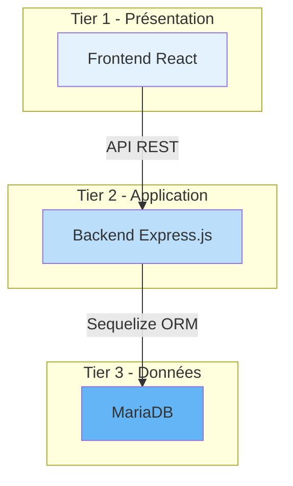
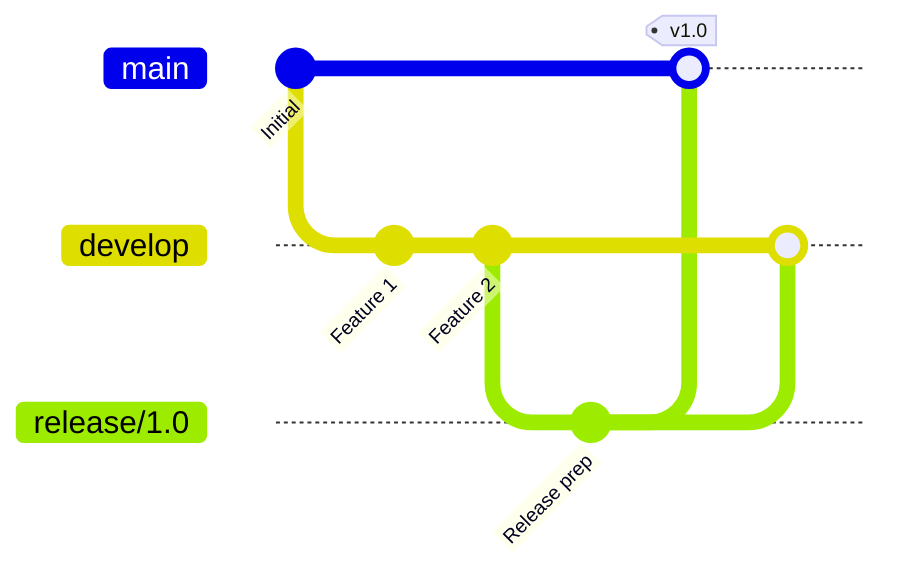

# Introduction

Bienvenue dans la documentation du projet **Cocktail ClicBoumPaf** !

## Phases du projet

Le projet est structuré en **trois phases progressives** :

### Phase 1 : DevSecOps GitFlow & Azure ARM/BICEP (Actuel)

**Stack :** React + Express.js + MariaDB  
**Déploiement :** Azure VM avec ARM Templates  
**CI/CD :** GitHub Actions avec GitFlow

**Ce que vous allez apprendre :**

- Mettre en place un workflow GitFlow (branches develop, release, main)
- Créer des pipelines CI/CD avec GitHub Actions
- Implémenter des tests automatisés (Jest, Cypress)
- Intégrer l'analyse de qualité (SonarQube)
- Scanner la sécurité (Snyk, Trivy, OWASP ZAP)
- Déployer sur Azure avec ARM/Bicep
- Gérer l'authentification OIDC pour Azure
- Implémenter une stratégie Canary Release

### Phase 2 : GitOps & Kubernetes (À venir)

**Stack :** React + Express.js + MariaDB  
**Déploiement :** Kubernetes (AKS ou EKS)  
**CI/CD :** ArgoCD / Flux

**Ce que vous allez apprendre :**

- Migrer vers Kubernetes
- Comprendre les concepts K8s (Pods, Services, Deployments, Ingress)
- Mettre en place GitOps avec ArgoCD/Flux
- Gérer les configurations avec Helm
- Implémenter le monitoring (Prometheus, Grafana)

### Phase 3 : Architecture Microservices (À venir)

**Stack :** Microservices + Event-Driven  
**Déploiement :** Kubernetes  
**CI/CD :** GitOps avancé

**Ce que vous allez apprendre :**

- Découper l'application en microservices
- Implémenter la communication asynchrone (message queues)
- Gérer la complexité des microservices
- Service mesh (Istio)
- Observabilité avancée

## Architecture actuelle (Phase 1)

L'application suit une architecture **3-tiers classique** :

**Composants :**

- **Frontend :** Application React moderne avec React Router
- **Backend :** API REST avec Express.js et authentification JWT
- **Base de données :** MariaDB avec Sequelize ORM

## Flux de développement (GitFlow)

Le projet utilise GitFlow pour gérer les différents environnements :

**Branches principales :**

- `main` : Production (déploiement final)
- `develop` : Intégration continue (environnement Canary)
- `release/*` : Préparation de release
- `feature/*` : Développement de fonctionnalités

## Workflows CI/CD

Le projet implémente **deux workflows principaux** :

### Workflow 01 - Integration (Pull Request → develop)

Déclenché lors d'une Pull Request vers `develop` :

1. **Tests Backend** (Jest)
2. **Tests Frontend** (Cypress E2E)
3. **Analyse SonarQube** (qualité du code)
4. **Scan Snyk** (vulnérabilités des dépendances)

### Workflow 02 - Canary (Push → develop)

Déclenché lors d'un push sur `develop` :

1. **Build Docker** (images backend + frontend)
2. **Scan Trivy** (vulnérabilités des containers)
3. **Deploy Azure** (VM avec ARM/Bicep)
4. **OWASP ZAP** (pentest de l'application déployée)

## Prérequis

Avant de commencer, vous devez connaître :

**Obligatoire :**

- Git & GitHub
- JavaScript/Node.js
- Concepts de base HTTP/REST
- Docker basics
- Linux command line

**Recommandé :**

- React basics
- Express.js
- SQL
- GitHub Actions
- Cloud computing (Azure)

[Liste complète des prérequis](prerequisites.md)

## Comment utiliser cette documentation

Cette documentation est organisée par thématique :

1. **Commencez par** [Prérequis](prerequisites.md) et [Installation](installation.md)
2. **Comprenez l'architecture** dans la section [Architecture](../architecture/overview.md)
3. **Explorez les workflows** dans [CI/CD & DevSecOps](../cicd/overview.md)
4. **Apprenez à déployer** dans [Infrastructure Azure](../infrastructure/arm-deployment.md)
5. **Développez** avec les guides de la section [Développement](../development/backend-api.md)

## Pourquoi "Cocktail" ?

> C'est juste un nom de projet fun pour un exercice pédagogique !  
> Il n'y a aucune logique métier de gestion de cocktails dans l'app.

L'important n'est pas **ce que fait l'application**, mais **comment elle est construite, testée, sécurisée et déployée**.

---

## Prochaines étapes

Prêt à commencer ? 

1. [Vérifiez les prérequis](prerequisites.md) 
2. [Installez le projet localement](installation.md) 
3. [Configurez votre environnement](configuration.md) 

---

