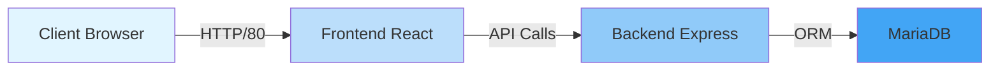

# Cocktail ClicBoumPaf

<div align="center">


**Projet d'étude DevSecOps avec GitFlow et déploiement Azure**

</div>

---

## À propos

Projet pédagogique conçu pour les étudiants, centré sur l'apprentissage des pratiques DevSecOps modernes à travers trois phases progressives :

### Phase 1️ : DevSecOps GitFlow & Azure ARM
Déploiement d'une architecture 3-tiers (Client-Serveur) sur Azure avec :

- Pipelines CI/CD avec GitHub Actions
- Tests automatisés (Backend, Frontend, E2E)
- Analyse de qualité (SonarQube)
- Scans de sécurité (Snyk, Trivy, OWASP ZAP)
- Déploiement ARM sur Azure VM
- Stratégie Canary Release

### Phase 2️ : GitOps & Kubernetes (À venir)
Migration vers une architecture Kubernetes avec déploiement GitOps

### Phase 3️: Microservices (À venir)
Évolution vers une architecture microservices sur Kubernetes

---

## Démarrage rapide

```bash
# Cloner le projet
git clone https://github.com/EfreiBdx/cocktail_base_3t.git

# Lancer l'environnement local avec Docker
docker-compose up -d

# Accéder à l'application
# Frontend: http://localhost:80
# Backend: http://localhost:12000
```

[Guide d'installation complet](getting-started/installation.md)

---

## Stack technique

### Frontend
- **React 19.0.0** - Interface utilisateur moderne
- **React Router 7.1.5** - Routing côté client
- **Vite 6.1.0** - Build tool ultra-rapide
- **Cypress 14.0.3** - Tests E2E

### Backend
- **Express.js 4.19.2** - Framework web Node.js
- **Sequelize 6.37.3** - ORM pour MySQL
- **JWT** - Authentification sécurisée
- **Jest** - Tests unitaires

### Infrastructure
- **Docker & Docker Compose** - Conteneurisation
- **Azure VM** - Hébergement cloud
- **MariaDB** - Base de données
- **GitHub Actions** - CI/CD

---

## Architecture



[Architecture détaillée](architecture/overview.md)

---

## Pipeline CI/CD

Le projet implémente deux pipelines principaux :

### Pipeline d'Intégration (Pull Request → develop)
1. **Tests** - Backend (Jest) + Frontend (Cypress)
2. **Qualité** - Analyse SonarQube
3. **Sécurité** - Scan Snyk des dépendances

### Pipeline Canary (Push → develop)
1. **Build** - Construction des images Docker
2. **Scan** - Analyse Trivy des containers
3. **Deploy** - Déploiement Azure VM
4. **Security** - Pentest OWASP ZAP

[Documentation CI/CD complète](cicd/overview.md)

---

## Sécurité

Le projet intègre plusieurs outils de sécurité :

| Outil | Phase | Objectif |
|-------|-------|----------|
| **Snyk** | Integration | Vulnérabilités des dépendances |
| **Trivy** | Canary | Scan des images Docker |
| **OWASP ZAP** | Canary | Pentest de l'application déployée |
| **SonarQube** | Integration | Qualité & sécurité du code |

[Guide sécurité](security/best-practices.md)

---

## Documentation

- [**Guide de démarrage**](getting-started/introduction.md) - Installation et premiers pas
- [**Architecture**](architecture/overview.md) - Comprendre l'architecture du projet
- [**CI/CD & DevSecOps**](cicd/overview.md) - Pipelines et automatisation
- [**Infrastructure Azure**](infrastructure/arm-deployment.md) - Déploiement cloud
- [**Développement**](development/backend-api.md) - Guide pour les développeurs
- [**Troubleshooting**](troubleshooting/common-issues.md) - Résolution de problèmes

---

## Contribuer

Les contributions sont les bienvenues ! Consultez le [guide de contribution](contributing.md).

---

## License

MIT License - Projet éducatif

---

